# The Beginner's Complete Guide to LLM Inference Engineering
### For the intern who just walked in and knows nothing yet

---

## How to Use This Document

Read it top to bottom. Every section builds on the last. By the end you will understand what the team is doing, why the infrastructure is set up the way it is, what the problems are, and how the work you will do fits into the bigger picture.

---

## Part 1: What Is This Team Working On?

The LTRC (Language Technologies Research Centre) team at IIIT Hyderabad runs its own GPU clusters - real machines with graphics cards in them, sitting in a server room, not rented from Amazon or Google. The goal is to **train and serve large language models (LLMs)** on this hardware.

An LLM is a neural network (think: a very large mathematical function) that generates text. ChatGPT, Gemini, and Claude are all LLMs. To make one work you need to:

1. **Train** it - run the model over huge amounts of text, adjusting billions of numbers (called parameters or weights) until the model gets good at predicting the next word.
2. **Serve** it - take the trained model and let people (or programs) send it prompts and get responses back in real time.

Both operations are extremely computationally expensive. That is why you need GPUs.

---

## Part 2: Understanding GPUs (Without an EE Degree)

A regular CPU (the main chip in your laptop) is great at doing one or two complex things at a time. A GPU is great at doing millions of simple things simultaneously. Neural networks are basically giant grids of numbers being multiplied together - which GPUs are perfect for.

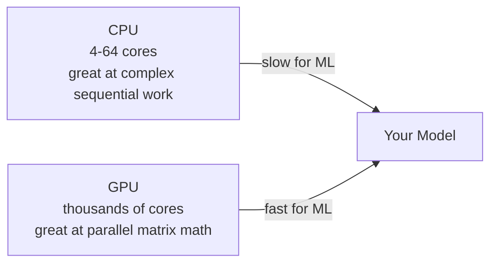

The team's clusters have NVIDIA GPUs. Each GPU has its own **VRAM** (Video RAM) - fast memory that sits right on the card. The model weights must fit in VRAM to run efficiently.

---

## Part 3: The Two Clusters - Ada and Turing

The team has access to two GPU clusters. Think of a cluster as a large collection of computers ("nodes") connected by a fast network, each node having several GPUs.

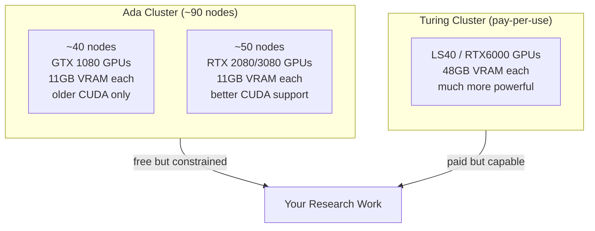

### What "11GB VRAM" means in practice

A model is stored as numbers. How many bytes those numbers take depends on **precision** (how many bits each number uses):

| Precision | Bits per number | Memory for a 7B parameter model |
|---|---|---|
| FP32 (full precision) | 32 bits = 4 bytes | ~28 GB |
| FP16 (half precision) | 16 bits = 2 bytes | ~14 GB |
| INT8 (8-bit integer) | 8 bits = 1 byte | ~7 GB |
| INT4 (4-bit integer) | 4 bits = 0.5 bytes | ~3.5 GB |

With 4 GPUs at 11GB each = 44GB total. This means:
- **7B params at FP32** → needs 28GB → fits across 4 GPUs ✓
- **10B params at FP16** → needs 20GB → fits across 4 GPUs ✓
- **70B params at FP16** → needs 140GB → does NOT fit ✗

The Turing cluster's 48GB cards are about 4× more capable per card.

---

## Part 4: The Two Phases of LLM Inference (Prefill vs Decode)

When you send a prompt to an LLM and it generates a response, there are two distinct phases happening under the hood:

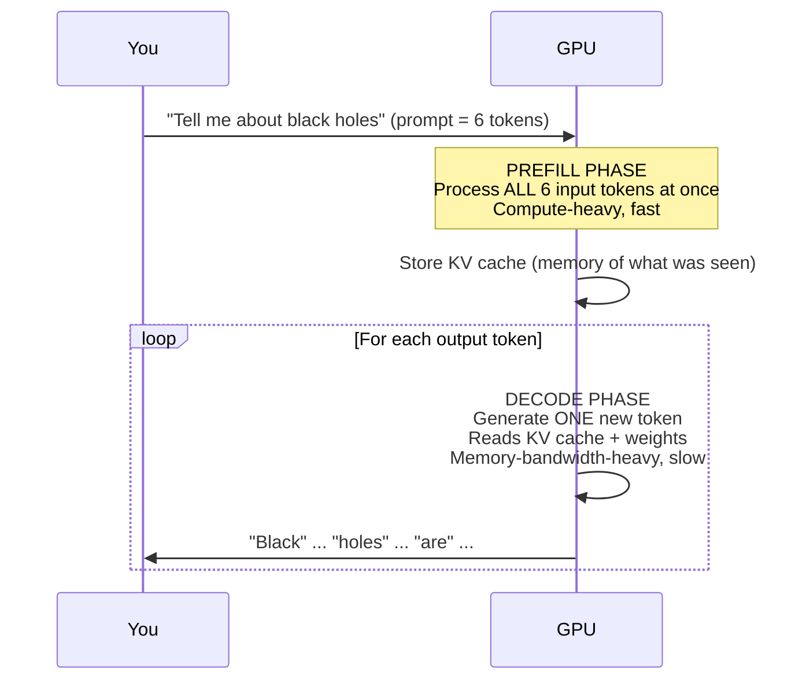

**Why this matters:** These two phases have different bottlenecks, so optimizing them requires different techniques. Prefill is limited by raw compute speed (TFLOPS). Decode is limited by how fast you can read data from memory (memory bandwidth, measured in TB/s).

---

## Part 5: The 7 Layers of the Inference Stack

Think of inference as a stack of layers, like floors of a building. Each floor depends on the one below it.

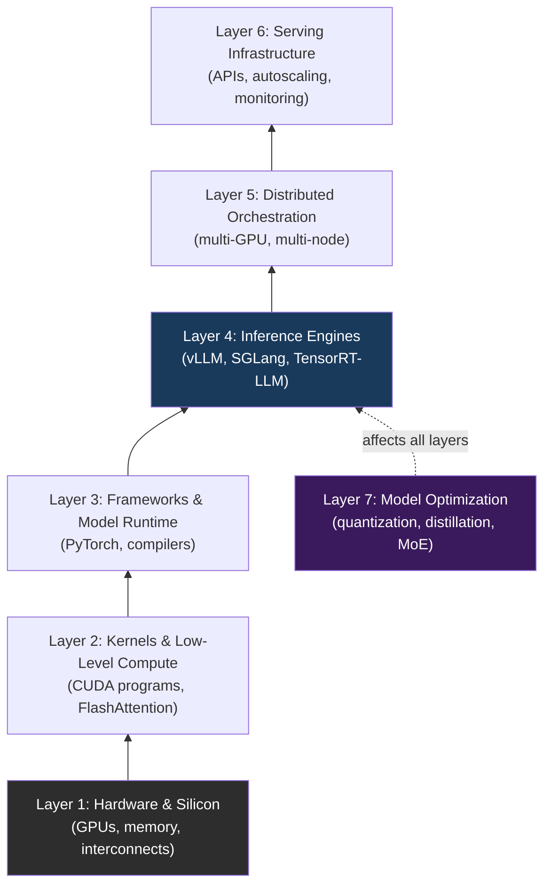

### Layer 1: Hardware & Silicon

**What it is in plain English:** The physical chips. GPUs, their memory (called HBM - High Bandwidth Memory), and the cables connecting them.

**The analogy:** This is like the road network of a city. Everything else (cars, trucks, buses) depends on how wide and fast the roads are. You cannot make traffic move faster than the road allows.

**Key concept - the Roofline Model:** Every GPU has two fundamental limits:
- **Compute ceiling:** How many math operations per second (TFLOPS)
- **Memory bandwidth ceiling:** How fast data moves from memory to cores (TB/s)

No software trick can exceed these physical limits.

**Relevant to our cluster:**
- GTX 1080: old, limited CUDA version support, only 11GB VRAM
- RTX 2080/3080: better, but still 11GB VRAM
- RTX 6000 (Turing): 48GB VRAM, modern CUDA, much more capable

**Impact on you:** When a model run crashes with "CUDA out of memory", this layer is why. The fix is either a smaller model, lower precision, or spreading across more GPUs.

---

### Layer 2: Kernels and Low-Level Compute

**What it is in plain English:** A "kernel" is a function that runs on the GPU - thousands of threads executing it simultaneously. When PyTorch does a matrix multiplication, it calls a kernel. When attention is computed, it calls a kernel.

**The analogy:** If hardware is the road, kernels are the engine design. Two cars on the same road can have very different speeds depending on how efficient their engines are.

**The biggest example - FlashAttention:**

Standard attention (the mechanism that makes transformers work) has a problem: it creates a huge intermediate matrix in slow GPU memory.

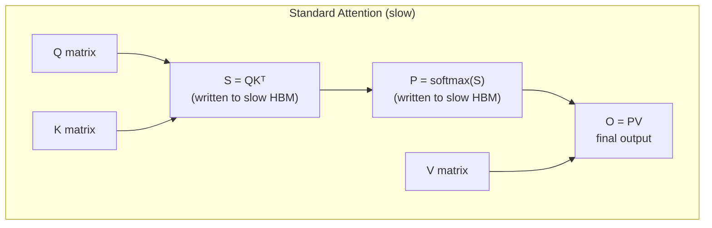

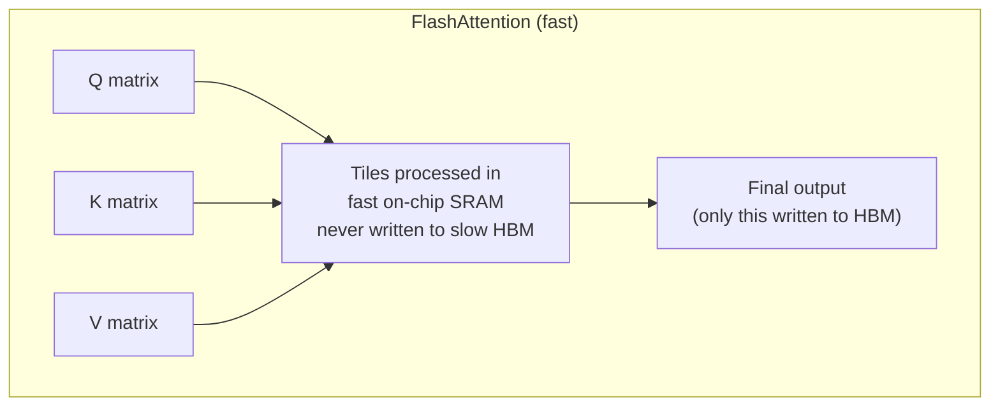

FlashAttention does the same math but 2-8× faster because it avoids expensive memory round-trips. This is a kernel-level optimization - same hardware, smarter program.

---

### Layer 3: Frameworks and Model Runtime

**What it is in plain English:** PyTorch is the "operating system" for AI models. You write your model in Python, and PyTorch handles translating that to GPU kernel calls, managing memory, and running backwards passes for training.

**The analogy:** If kernels are the engine, the framework is the transmission system - it decides which gear to use, when to accelerate, how to distribute power.

**Two modes of execution:**

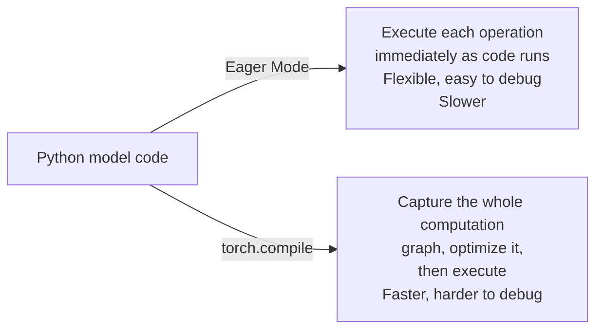

**Key vocabulary:**
- **Autograd:** PyTorch automatically computes gradients for training (you don't do it by hand)
- **CUDA Graph:** Record a sequence of GPU operations once, then replay it very fast
- **Operator Fusion:** Combine two small operations into one large one to avoid overhead

---

### Layer 4: Inference Engines

**What it is in plain English:** An inference engine is a specialized system for serving LLMs to many users at once efficiently. vLLM is the most popular one. Think of it as the "restaurant manager" that decides which orders to batch together and how to use the kitchen (GPU) as efficiently as possible.

**The naive problem - why you need an engine:**

Without an engine, you process one request at a time:

```mermaid
gantt
    title Naive serving: one request at a time
    dateFormat X
    axisFormat %s

    section GPU (wasted!)
    Request 1 (prefill + decode) :0, 5
    GPU IDLE :5, 7
    Request 2 (prefill + decode) :7, 12
    GPU IDLE :12, 14
```

**With continuous batching (what vLLM does):**

```mermaid
gantt
    title Continuous batching: GPU always busy
    dateFormat X
    axisFormat %s

    section GPU utilization
    Req1 prefill :0, 2
    Req1+Req2 decode together :2, 4
    Req1+Req2+Req3 decode :4, 6
    Req2+Req3 decode (Req1 finished) :6, 8
```

As soon as one request finishes, another joins the batch mid-flight. The GPU is almost never idle.

**PagedAttention - solving the memory fragmentation problem:**

The KV cache (the model's "working memory" during generation) has variable size per request. Allocating a fixed block for each request wastes memory (like reserving a whole hotel floor for one guest).

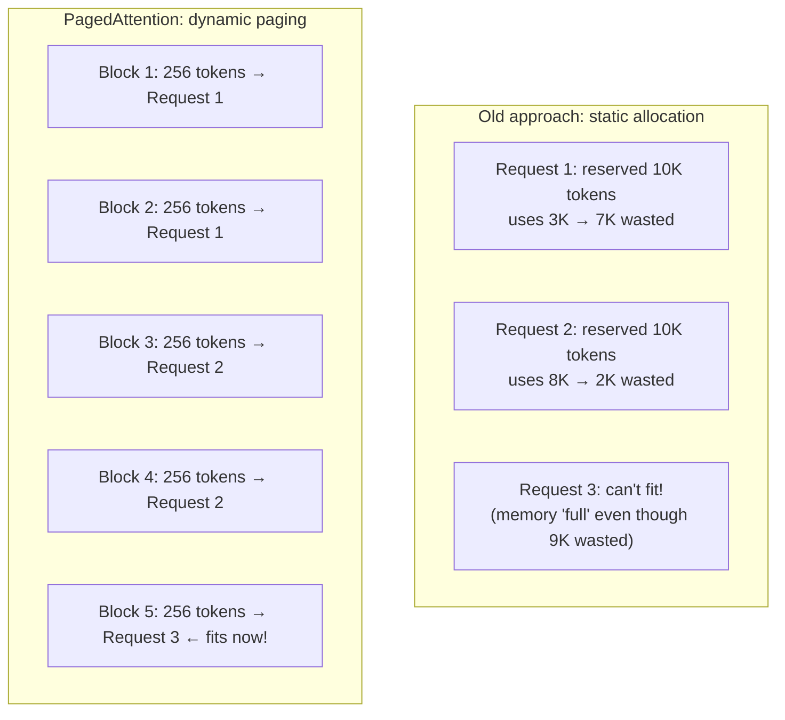

**Key metrics you will care about:**
- **TTFT:** Time to First Token - how long until the user sees the first word
- **ITL / TPOT:** Inter-Token Latency - how long between each subsequent word
- **Throughput:** How many tokens per second the system produces total

---

### Layer 5: Distributed Orchestration

**What it is in plain English:** When a model is too big for one GPU, or you want to serve millions of users, you need to coordinate many GPUs. This layer decides how to split the work and how GPUs communicate.

**The four ways to split a model across GPUs:**

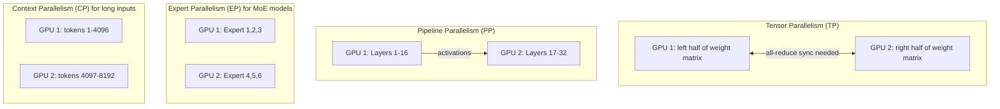

**Why "cross-node" communication is the hard part:**

Within a single node (4 GPUs), NVIDIA's NVLink connects them at ~600 GB/s. Between nodes, you rely on InfiniBand or Ethernet, which is ~10-200 GB/s. This bottleneck is exactly why the Ada cluster struggles:

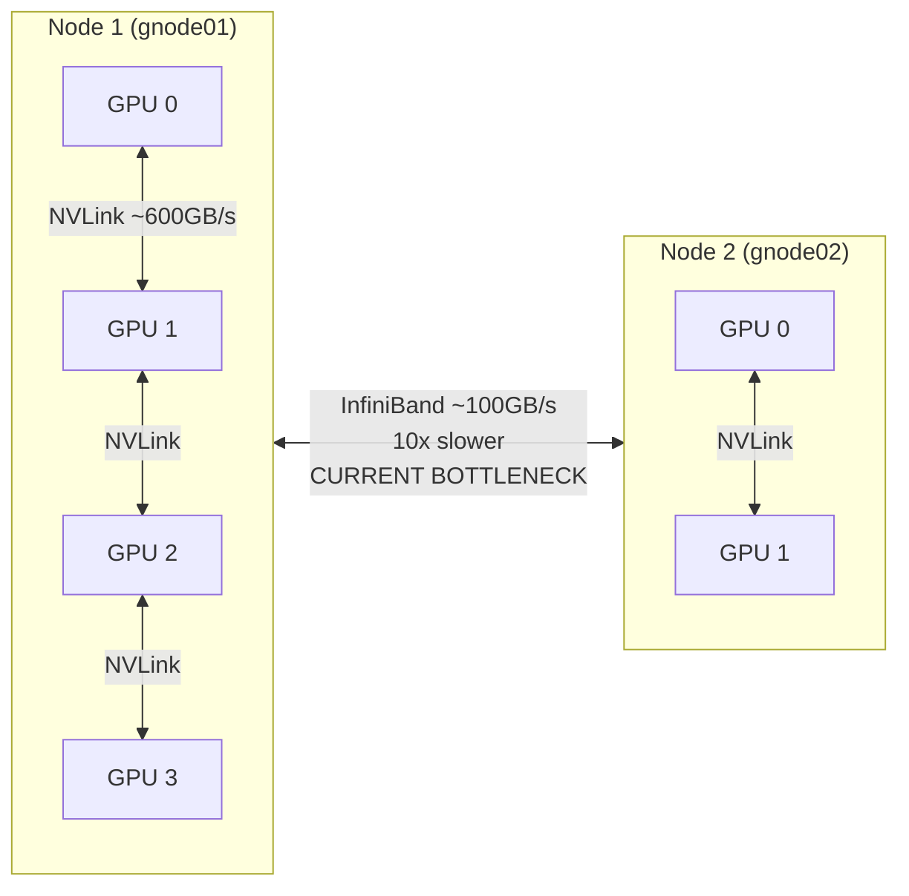

This is why the meeting notes say "distribute to multiple GPUs across gnodes: not feasible due to network bottleneck."

---

### Layer 6: Serving Infrastructure and Production

**What it is in plain English:** Once your model is running, you need to make it into a real service - with an API endpoint, load balancing, health checks, cost controls, and the ability to handle sudden spikes in traffic.

**The anatomy of a production serving setup:**

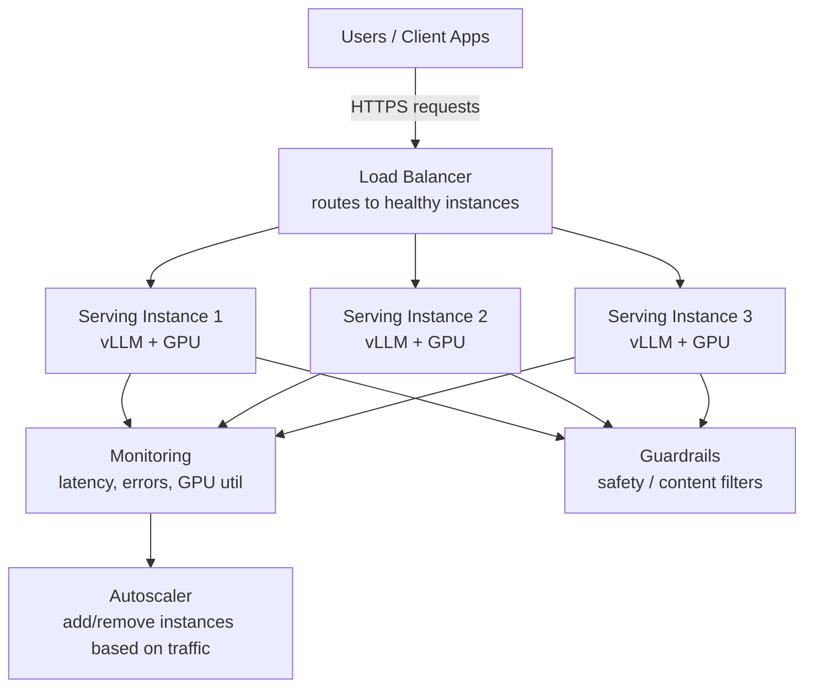

**Key vocabulary:**
- **SLA/SLO:** Service Level Agreement/Objective - the promise you make about latency and uptime (e.g., "99% of requests complete in under 2 seconds")
- **P95/P99 latency:** The response time that 95%/99% of requests are faster than - used instead of average because averages hide the slowest users
- **Blue-Green Deployment:** Run old and new versions simultaneously; switch traffic over only when new version is healthy - zero downtime updates
- **Streaming:** Sending tokens to the user one-by-one as they are generated (what gives ChatGPT that typewriter effect)

---

### Layer 7: Model Optimization Techniques

**What it is in plain English:** Before any of the above layers, you can make the model itself smaller and faster - without training a new one from scratch. This is called post-training optimization.

**The precision ladder - trading accuracy for speed:**

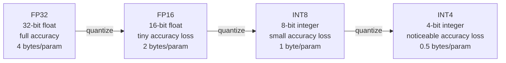

A 7B model at FP32 = ~28GB. The same model at INT4 = ~3.5GB. That is 8× smaller, and can fit on a single 11GB GPU card on Ada.

**Other key techniques:**

| Technique | What it does | Why it helps |
|---|---|---|
| Knowledge Distillation | Train a small "student" model to mimic a large "teacher" model | Smaller model, similar quality |
| MoE (Mixture of Experts) | Model has many sub-networks ("experts"), only 2-3 activate per token | Same parameter count, less compute per token |
| GQA (Grouped Query Attention) | Multiple attention heads share key/value projections | Smaller KV cache, faster decode |
| LoRA / PEFT | Fine-tune only a tiny fraction of parameters | Cheap customization without full retraining |

---

## Part 6: The Problems with Our Cluster Right Now

This section maps the infrastructure issues from the meeting notes to the technical concepts above.

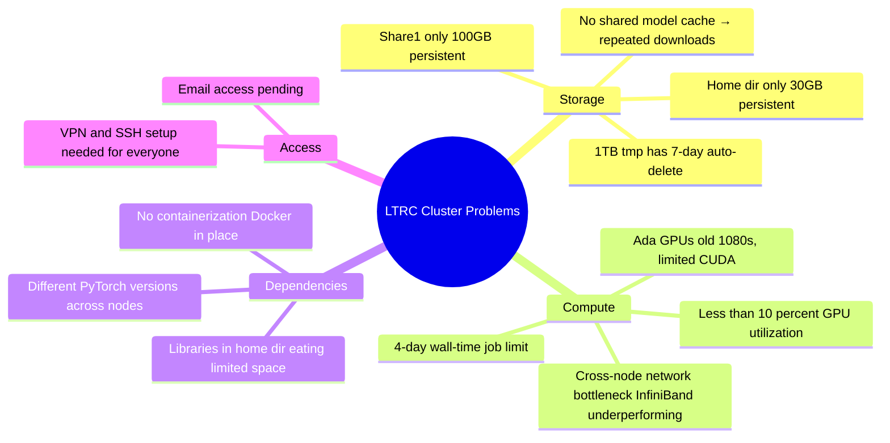

### The Storage Problem in Detail

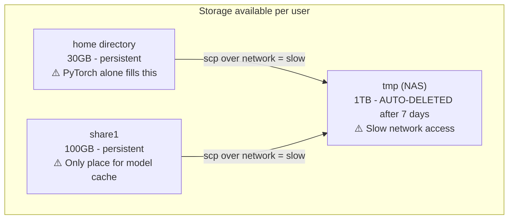

**The recommendation** from the team: Buy a NAS (Network Attached Storage) device, replicate it to Ada and Turing, and use it as a shared model/data cache. This would eliminate the repeated downloading of the same models by every student.

### The Compute Problem in Detail

| Scenario | Ada 1080 (4 GPUs, 44GB total) | Turing RTX6000 (4 GPUs, 192GB total) |
|---|---|---|
| 8B param model FP16 training | 4 days (if no OOM) | 1 day |
| 70B param model | Impossible | Just barely fits |
| Flash-attention optimization | Not supported | Supported |
| FP8 / mxfp4 | Not supported | Not supported (needs H/B series) |

---

## Part 7: The Work Plan - What You Will Actually Do

This is the sequence of tasks from the April 14 meeting, mapped to the inference stack layers above:

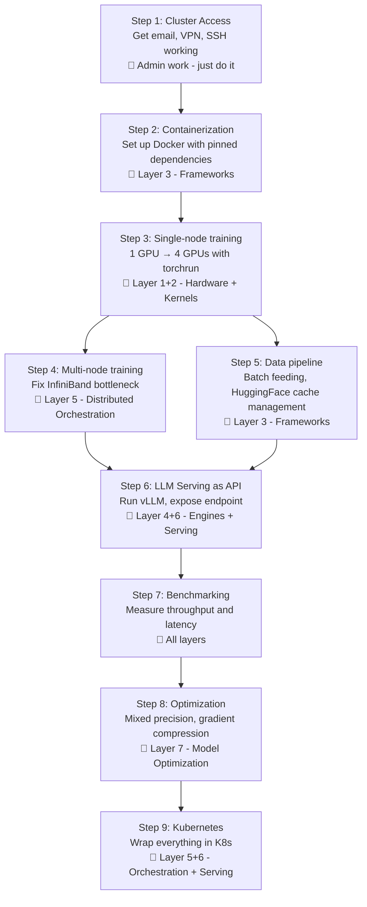

### Your Day One

SSH into one node. Run:
```bash
nvidia-smi                         # check GPUs are visible
python -c "import torch; print(torch.cuda.is_available())"  # check PyTorch
```

Then run a toy training script on one GPU. Once that works, containerize it with Docker. That is the foundation everything else builds on.

---

## Part 8: Key Vocabulary Reference

### GPU Memory Terms

| Term | Meaning |
|---|---|
| VRAM / GPU memory | Memory on the GPU card itself (fast, expensive, limited) |
| HBM | High Bandwidth Memory - the stacked RAM on modern GPUs |
| SRAM / Shared memory | Very fast on-chip buffer inside the GPU (tiny, ~20MB) |
| OOM | Out of Memory - your model is too big for the VRAM |

### Training Terms

| Term | Meaning |
|---|---|
| Parameters / weights | The numbers inside a model that are learned during training |
| Gradient | The direction and magnitude to adjust each weight |
| Batch | A group of examples processed together in one forward pass |
| NCCL | NVIDIA's library for GPU-to-GPU communication during training |
| DDP | DistributedDataParallel - each GPU gets a copy of the model, gradients averaged across GPUs |
| FSDP | Fully Sharded Data Parallel - model weights split across GPUs (more memory efficient than DDP) |
| ZeRO | Microsoft's optimization that shards optimizer state, gradients, and weights |

### Inference Terms

| Term | Meaning |
|---|---|
| Prefill | Processing the input prompt - compute-heavy |
| Decode | Generating output tokens one at a time - memory-bandwidth-heavy |
| KV Cache | Stored attention key/value tensors - avoids recomputing past tokens |
| Continuous Batching | Dynamically grouping multiple requests at the token level |
| Speculative Decoding | A fast "draft" model proposes tokens; the main model verifies in parallel |
| TTFT | Time to First Token |
| ITL | Inter-Token Latency |

### Infrastructure Terms

| Term | Meaning |
|---|---|
| Node / gnode | One physical machine (with its GPUs) in a cluster |
| NVLink | NVIDIA's fast cable connecting GPUs within a node (~600 GB/s) |
| InfiniBand | Fast network between nodes (~100 GB/s - much slower than NVLink) |
| SLURM | Job scheduler software used on HPC clusters to queue and run jobs |
| Docker | Containerization tool - packages your code + dependencies into a portable image |
| Kubernetes (K8s) | Orchestrates many Docker containers across many machines |
| NAS | Network Attached Storage - a shared disk accessible over the network |
| Wall-time | Maximum time a job is allowed to run before the scheduler kills it |

---

## Part 9: How Everything Connects - The Full Picture

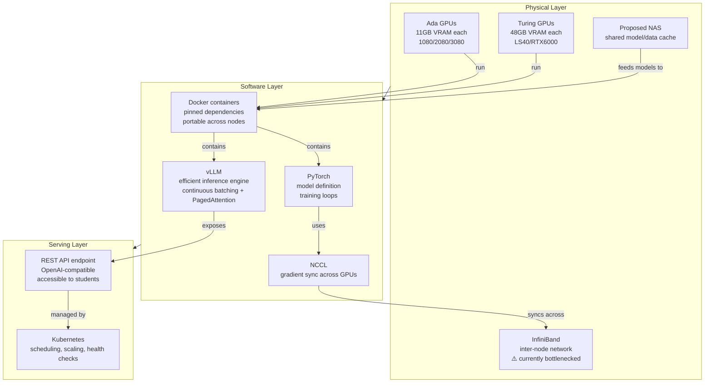

---

## Part 10: Suggested Learning Path

If you are a complete beginner, do these in order:

1. **GPU basics:** Watch "But what is a neural network?" by 3Blue1Brown. Then watch NVIDIA's intro to CUDA.
2. **PyTorch:** Work through the official PyTorch 60-minute blitz tutorial.
3. **Distributed training:** Read HuggingFace's "Efficient Training on Multiple GPUs" guide.
4. **vLLM:** Read the PagedAttention blog post. Run `python -m vllm.entrypoints.openai.api_server --model <small-model>`.
5. **Docker:** Do Docker's official "Get Started" tutorial. Containerize a PyTorch script.
6. **Profiling:** Run `nvidia-smi dmon` while a model runs. Understand what GPU utilization and memory usage mean.

Once you have done all of that, you will understand 80% of the work happening in this project.
