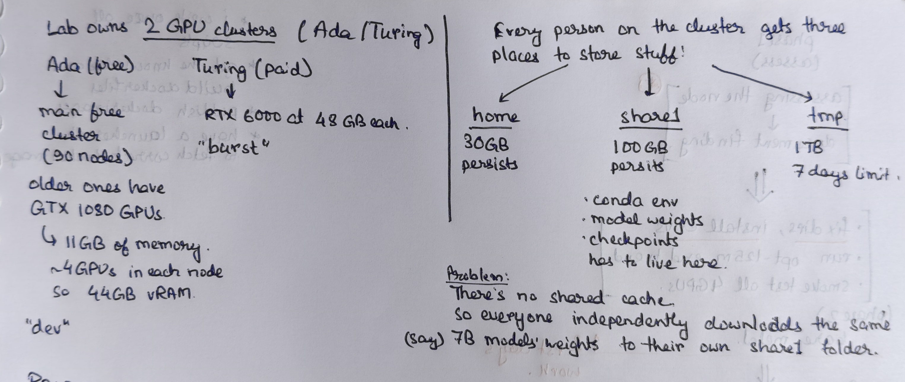
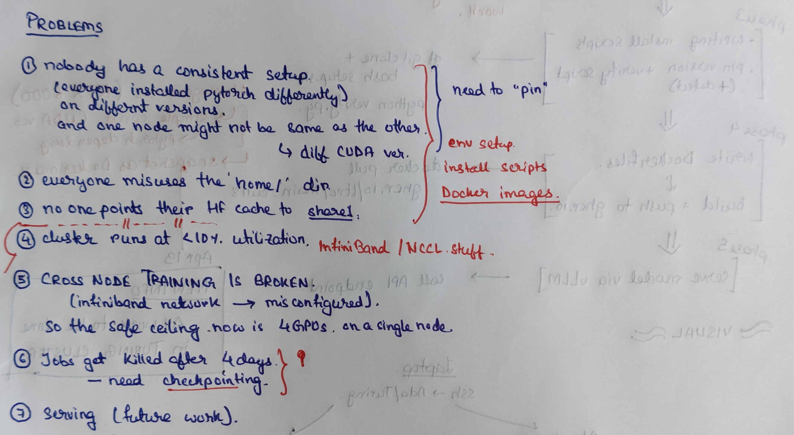

# problems to solve

ordered immediate to long term. each problem blocks or shapes what comes after it.

### at a glance

| Fact | Why it matters |
|---|---|
| `home` = 30GB, `share1` = 100GB, `tmp` = 1TB but 7-day delete | Never install envs or cache models in `home` or `tmp` |
| Turing: LS40/RTX6000 cards, 48GB VRAM each | Max 4 GPUs × 48GB = 192GB per job; 70B FP16 fits |
| 4-day wall-time limit | Checkpoint early, checkpoint often |
| Cross-node InfiniBand is currently bottlenecked | Single-node 4-GPU is the reliable ceiling for now |
| `nlp`/`irel` accounts have 12 GPUs + no time limit | Ask about access - changes what's feasible |

## immediate

**access**
- VPN and SSH access not set up for everyone on the team
- email accounts pending for new members
- unclear which accounts (Turing, nlp, irel) each person has access to

**environment**
- different PyTorch versions installed across nodes - jobs that work on one node may silently fail on another
- PyTorch and all libraries installed in home (~30GB limit) - fills up before any model is downloaded
- no shared conda env or Docker image - every student sets up from scratch, diverging over time
- HF model cache not pointed at share1 - models re-downloaded repeatedly by each students.

## short term

**compute constraints on Turing**
- 48GB VRAM per GPU, 192GB across 4 GPUs max - 70B FP16 fits; FP8/mxfp4 not available (needs H/B series)
- 4-day wall-time limit on all jobs - any training run longer than that gets killed; checkpointing is mandatory

**storage**
- home: 30GB persistent - cannot hold an env and models simultaneously
- share1: 100GB persistent - the only viable location, but shared and finite
- tmp: 1TB but auto-deleted after 7 days - cannot be used for anything that needs to persist
- no shared model/data cache - each student downloads the same models independently, wasting share1

**single-node utilization**
- cluster running at <10% GPU utilization - hardware exists but nobody is using it properly
- no benchmarking harness in place - no way to measure whether changes actually help

**observability**
- no telemetry or logging infrastructure — pilot requires usage metrics and visualization as a Phase A deliverable; vLLM Prometheus endpoint and per-job GPU utilization logs must be wired from first deployment

## medium term

**cross-node training**
- InfiniBand between nodes is misconfigured or underperforming - multi-node gradient sync is not feasible yet
- distributing a model across gnodes fails due to network bottleneck
- NCCL version and IB support status unknown - needs investigation before any multi-node work

**dependency and portability**
- no Docker images in place - moving a working job to cloud requires manual env reconstruction
- no pinned, reproducible environment - experiments are not reliably reproducible across nodes or students
- no dev-mode vs burst-mode distinction in current workflow — dev (interactive Turing sessions) and burst (scheduled K8s jobs, cloud-portable) require different image designs

**data pipeline**
- no structured data pipeline - training can stall on I/O if data loading is not set up properly
- large datasets have nowhere to live persistently given storage constraints

## long term

**serving**
- no model is currently served as an API - the stated goal of the project requires this
- no load testing or latency/throughput baseline established
- no decision made on internal vs external API exposure or authentication

**infrastructure**
- no NAS in place - proposed solution to shared model/data cache problem; not yet purchased or set up
  > **NOTE:** In the pilot proposal, NAS is a Phase A deliverable and a hard prerequisite for the shared model cache. This is currently blocked pending hardware purchase. Track its status actively with the supervisor — once available, all cache paths (`HF_HOME`, pip, conda) must move to the NAS mount.
- Kubernetes layer discussed but not in place - infra is not self-serve for other students/projects
  > **NOTE:** In the pilot proposal, Kubernetes is funded and scoped to Phase A — running in parallel with storage and container work, not sequenced after serving. The intern does not implement K8s, but all Docker work must be K8s-compatible from the start: no hardcoded paths, env variable injection for all configurable values, health check endpoints on all serving processes.
- no autoscaling or GPU-aware job scheduling beyond what the existing scheduler provides
- B/H-series GPU capabilities (mxfp4, mxfp8, larger VRAM) completely unavailable on current hardware - limits what optimizations are even possible

**model optimization**
- no quantization workflow established - needed for running the very largest models efficiently
- no evaluation harness - no way to verify that a quantized or fine-tuned model still performs acceptably
