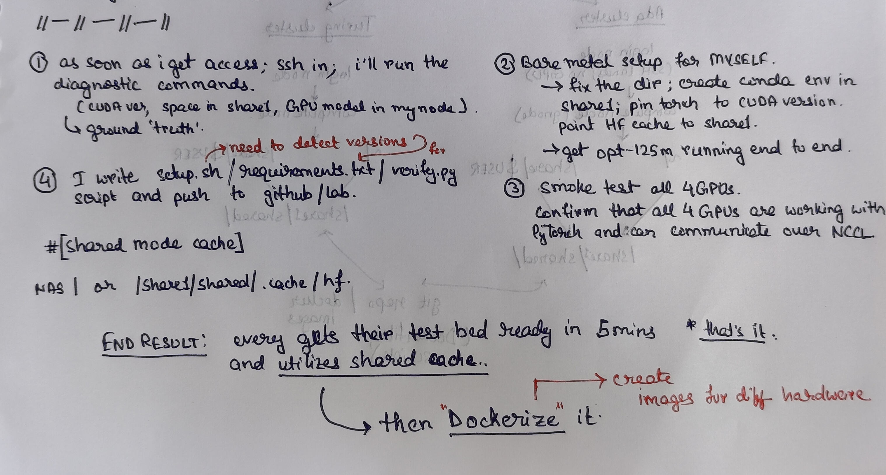
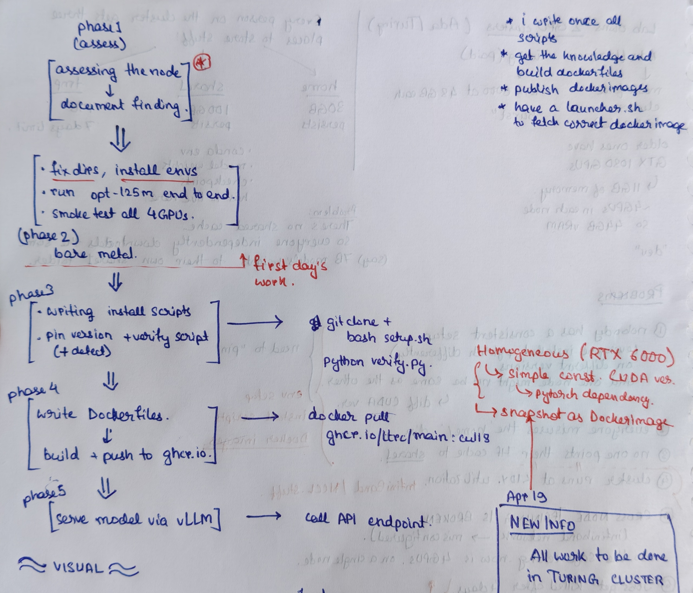

# stage 0

## aim

**short term:** get a working test bed on Turing - environment, GPU verified, a model running inference and training end to end, benchmarked, containerized.

**long term:** serve LLMs as an API on cluster infrastructure, with distributed training across nodes, quantization workflows, and Kubernetes-managed self-serve infra for the lab.

## fit to pilot

Stage0 outputs feed directly into Phase A of the LTRC Infrastructure Upgrade Pilot. The verified Turing environment, Docker image with pinned dependencies, benchmark baseline (tokens/sec, GPU util, TTFT), and vLLM endpoint with Prometheus metrics are all explicit Phase A inputs — not prerequisites to some later phase.

NAS and Kubernetes are parallel tracks run by the broader team. NAS is a Phase A prerequisite currently blocked on hardware purchase; once available, all cache paths must migrate to the NAS mount. K8s is also Phase A, not sequenced after serving is stable. The intern's job is to produce K8s-compatible artefacts: no hardcoded paths, all configurable values via environment variables, health check and metrics endpoints on every serving process.

See [knowledge/pilot_alignment.md](../knowledge/pilot_alignment.md) for the full phase breakdown and alignment table.

## infrastructure

**Turing** (pay-per-use):
- homogeneous cluster: all nodes have LS40/RTX6000 cards, 48GB VRAM each
- up to 4 GPUs per job = 192GB ceiling
- 4-day wall-time limit; nlp/irel accounts get 12 GPUs with no time limit
- storage: home 30GB + share1 100GB (both persistent), tmp 1TB (7-day delete)
- modern enough for FP16 training but still no mxfp4/mxfp8 or FlashAttention (needs H/B series)
- cross-node InfiniBand is underperforming - multi-gnode training not yet viable
- current target: all dev, training, and serving runs

**proposed fixes** (from infra recommendations):
- NAS purchase for shared model/data cache replicated to Turing
- Docker containers with pinned libraries for reproducibility and portability
- dev-mode vs burst-mode distinction: dev on Turing, burst movable to cloud

## storage

| location | size | persists? | use for |
|---|---|---|---|
| `~/` (home) | 30GB | yes | dotfiles, bashrc only |
| `/share1/$USER/` | 100GB | yes | env, model cache, checkpoints |
| `/tmp/` | 1TB | no - 7 day delete | scratch only |

everything goes in share1. home fills up fast. tmp disappears.

## environment setup

0. check if a shared conda env or Docker image already exists on share1 — do not rebuild from scratch if a teammate has already set one up; confirm PyTorch + CUDA versions match before inheriting
1. assess the node — `nvidia-smi`, `nvcc --version`, `df -h`, `ls /share1/`
2. point all cache dirs (HF, pip, conda) at `/share1/$USER/` before installing anything
3. create conda env under `/share1/$USER/envs/` — match torch build to CUDA version from `nvcc`; env + cache should stay under 40GB to leave room for models
4. verify GPU visible to PyTorch and VRAM reads 48GB
5. proof of life — run `opt-125m` inference; confirm model lands in share1 not home
6. verify all 4 GPUs enumerate correctly
7. multi-GPU smoke test with `torchrun --nproc_per_node=4`
8. once bare-metal env is stable, containerize with Docker — pin torch + transformers + CUDA version

## constraints

| constraint | impact |
|---|---|
| 192GB VRAM ceiling (4x 48GB) | 70B FP16 fits; FP8/mxfp4 not available (needs H/B series) |
| share1: 100GB persistent | env + cache + checkpoints must all fit here |
| 4-day wall-time on all jobs | checkpoint every run without exception |
| InfiniBand underperforming | cross-node training not viable yet; 4-GPU single-node is the ceiling |
| <10% GPU utilization cluster-wide | no benchmarking baseline exists yet |
| K8s-compatible Docker images required | no hardcoded paths; use env vars; expose `/health` and `/metrics` on all serving processes |

## todo

- [ ] get VPN + SSH access, confirm Turing/nlp/irel account status
- [ ] confirm NAS purchase status with supervisor — if available, update HF_HOME and all cache paths to NAS mount; if not, use /share1/$USER as interim
- [ ] run assessment commands on first node (nvidia-smi, nvcc, df -h)
- [ ] set cache env vars, create conda env in share1
- [ ] verify GPU visible to PyTorch — CUDA version matched, confirmed with teammates on torch version
- [ ] run opt-125m inference, confirm model cached in share1 not home
- [ ] all 4 GPUs verified, torchrun multi-GPU smoke test passes
- [ ] decide: what model, what precision, what task
- [ ] set up HF streaming dataset, confirm no I/O stall
- [ ] LoRA finetune on toy data, single GPU, checkpoint saves mid-run and reloads (mandatory given 4-day wall-time)
- [ ] torchrun 4-GPU DDP, measure throughput vs 1 GPU
- [ ] write down benchmark numbers (GPU util, tokens/sec, latency)
- [ ] Dockerfile — pin torch + transformers + CUDA version
- [ ] vLLM on single node, hit it with curl
- [ ] wire vLLM Prometheus metrics endpoint — required for pilot telemetry
- [ ] investigate InfiniBand bandwidth, NCCL IB support
- [ ] quantization workflow (INT8/INT4 for larger models)
- [ ] Kubernetes (parallel track — not your implementation task, but design all Docker images to run inside K8s pods from day one)